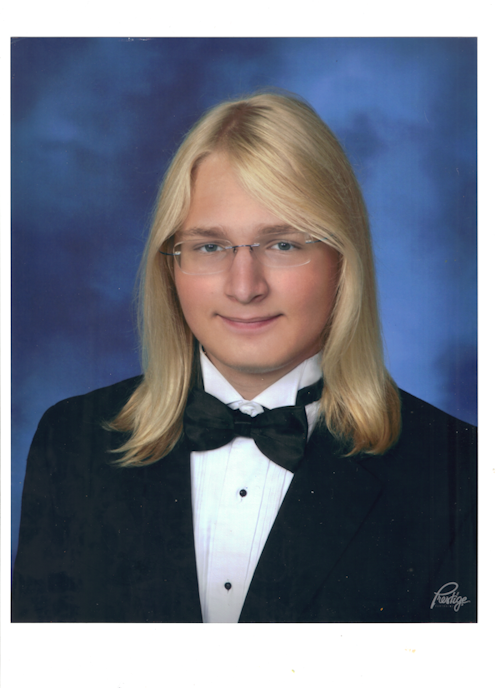

# CPS-493-Web-Server-Programming

A Repository for my CPS 493 classwork, Following along with the professor

## Pippin Bacon

Comp sci major, Junior year 2nd semester. Taken all the basic comp sci courses and Object oriented programming, Computer architecture, and web design. Taking Operating systems and discrete mathematics for computing this semester. Built simple connected web pages in Web design last semester. I feel like I'm going to be as prepared as I'll ever be for this course.

I hope to develop my own apps after this course, and I am really excited to learn as much as I can. The worst thing a class can be for me is boring, and I think that this course will be far from it.
